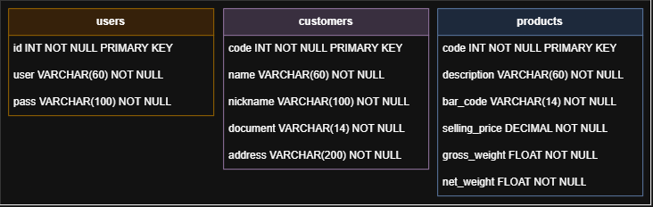
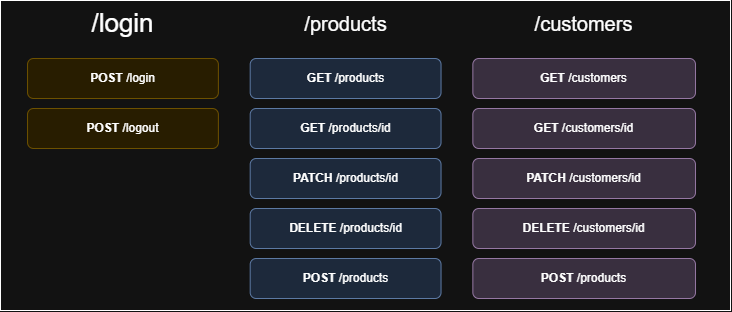

# Soft-Line Code Challenge

> Repositório do desafio técnico para Desenvolvedor Pleno da Soft-Line Sistemas.

## 🌐 Aplicação em Produção

Acesse: [https://ghcarvalho.com.br](https://ghcarvalho.com.br)

## 🛢️ Modelo das tabelas do Banco de Dados


## 🛣️ Modelo das rotas


## 🚀 Como rodar este projeto

Você pode rodar o projeto de duas formas: **localmente** (Java + Maven + SQL Server instalados na sua máquina) ou via **Docker Compose** (sobe todos os serviços automaticamente, incluindo o banco de dados).

---

### 🖥️ Opção 1 — Rodando localmente

#### 📋 Requisitos

- ☕ **Java 17+** — [Download](https://www.oracle.com/java/technologies/downloads/)
- 📦 **Maven** — [Download](https://maven.apache.org/download.cgi)
- 🗄️ **SQL Server** — [Download](https://www.microsoft.com/en-us/sql-server/sql-server-downloads)
- 🛠️ **SQL Server Management Studio (SSMS)** — [Download](https://learn.microsoft.com/en-us/ssms/install/install)
- 💻 **Git** — [Download](https://git-scm.com/downloads)

#### ⚙️ Configuração

1. Clonando o repositório:

```bash
git clone http://github.com/gabriel-cheng/softline-challenge
cd softline-challenge
```

2. Criando o banco

O script `src/main/resources/db/scripts/init-db.sql` cria o banco `softlineChallenge` automaticamente (só cria se ele ainda não existir). Abra esse arquivo no SSMS, conecte na sua instância local do SQL Server e execute o script — não é necessário criar o banco manualmente antes.

3. Configurando o `.env`
> - Copie o arquivo `.env.example` da raiz do projeto <br>
> - Renomeie a cópia para `.env` <br>
> - Preencha as variáveis abaixo (usadas pelo `docker-compose.yml` para configurar os containers):

```env
DATABASE_USERNAME=sa
DATABASE_PASSWORD=SuaSenhaAqui
JWT_SECRET=SeuSegredoAqui
```

4. Instalando as dependências
> - Na raíz do projeto, rode o seguinte comando e aguarde a instalação das dependências:
```bash
mvn install
```

5. Rodando o projeto
```bash
mvn spring-boot:run
```

A aplicação sobe em `http://localhost`.

---

### 🐳 Opção 2 — Rodando com Docker Compose

#### 📋 Requisitos

- 🐳 **Docker** e **Docker Compose** — [Download](https://www.docker.com/products/docker-desktop/)
- 💻 **Git** — [Download](https://git-scm.com/downloads)

#### ⚙️ Configuração

1. Clonando o repositório:

```bash
git clone http://github.com/gabriel-cheng/softline-challenge
cd softline-challenge
```

2. Clone o repositório do frontend na raíz do backend:<br>
⚠️ ATENÇÃO: O `docker-compose.yml` builda tanto o backend quanto o frontend a partir de código-fonte local — ele **não baixa o frontend automaticamente**. Antes de rodar `docker compose up`, clone o repositório do frontend na **raiz deste projeto**.

```bash
git clone http://github.com/gabriel-cheng/softline-challenge-frontend
```

3. Configurando o `.env`
> - Copie o arquivo `.env.example` da raiz do projeto <br>
> - Renomeie a cópia para `.env` <br>
> - Preencha as variáveis abaixo (usadas pelo `docker-compose.yml` para configurar os containers):

```env
DATABASE_USERNAME=sa
DATABASE_PASSWORD=SuaSenhaAqui
JWT_SECRET=SeuSegredoAqui
```

4. Suba todos os serviços (SQL Server, criação do banco, backend, frontend e proxy Nginx):

```bash
docker compose up --build
```

A ordem de inicialização é automática: o SQL Server sobe e aguarda passar no healthcheck; em seguida, o serviço `db-init` roda o script `init-db.sql` e cria o banco `softlineChallenge` (caso ainda não exista); só depois disso o backend inicia — evitando tanto erros de conexão prematura quanto a necessidade de criar o banco manualmente.

5. Acesse a aplicação em `http://localhost`.

---

### ☸️ Deploy em Produção (Kubernetes)

Em produção, a aplicação roda em um cluster **k3s**, com:

- **Traefik** como Ingress Controller, roteando `/api` para o backend e `/` para o frontend
- **cert-manager** gerenciando certificados TLS via Let's Encrypt
- Variáveis de ambiente injetadas via `Secret` (`softline-secrets`) e lidas em runtime pelo pod

Os manifests (`Deployment`, `Service`, `Ingress`, `Middleware`) estão disponíveis na pasta `k8s/` do repositório.

---

## 🔑 Endpoints

> As rotas marcadas como **requer autenticação** exigem o cookie `auth_token`, obtido via `POST /auth/login`. Rotas de `products` e `customers` retornam e afetam apenas os registros pertencentes ao usuário autenticado.

### 🔐 Auth

**POST** `/auth/login` — realiza o login e define o cookie de autenticação _(rota pública)_
```json
{
    "username": "gabriel@user",
    "password": "gabriel123"
}
```

**POST** `/auth/logout` — encerra a sessão removendo o cookie _(rota pública, sem corpo de requisição)_

---

### 👤 Users

**POST** `/users` — cadastra um novo usuário _(rota pública)_
```json
{
    "username": "gabriel@user",
    "password": "gabriel123"
}
```

**GET** `/users/me` — retorna os dados do usuário autenticado _(requer autenticação, sem corpo de requisição)_

**PATCH** `/users/me` — atualiza o usuário autenticado; campos opcionais _(requer autenticação)_
```json
{
    "username": "gabriel@user",
    "password": "gabriel123"
}
```

---

### 📦 Products

**GET** `/products` — lista os produtos do usuário autenticado _(requer autenticação, sem corpo de requisição)_

**POST** `/products` — cadastra um novo produto vinculado ao usuário autenticado _(requer autenticação)_
```json
{
    "code": 10,
    "description": "Lorem ipsum dolor sit amet.",
    "bar_code": "78949007000155",
    "selling_price": 50.00,
    "gross_weight": 13.0,
    "net_weight": 12.05
}
```

**PATCH** `/products/{code}` — atualiza um produto do usuário autenticado; campos opcionais _(requer autenticação)_
```json
{
    "description": "Lorem ipsum dolor sit amet.",
    "bar_code": "78949007000155",
    "selling_price": 50.00,
    "gross_weight": 13.0,
    "net_weight": 12.05
}
```

**DELETE** `/products/{code}` — remove um produto do usuário autenticado _(requer autenticação, sem corpo de requisição)_

---

### 🧾 Customers

**GET** `/customers` — lista os clientes do usuário autenticado _(requer autenticação, sem corpo de requisição)_

**POST** `/customers` — cadastra um novo cliente vinculado ao usuário autenticado _(requer autenticação)_
```json
{
    "code": 10,
    "name": "John Doe",
    "nickname": "John Doe's corp.",
    "document": "91711805000107",
    "address": "7404 Hayes Burgs, Apt. 836, 82527-9356, West Jersey, Utah, Estados Unidos"
}
```

**PATCH** `/customers/{code}` — atualiza um cliente do usuário autenticado; campos opcionais _(requer autenticação)_
```json
{
    "name": "John Doe",
    "nickname": "John Doe's corp.",
    "document": "91711805000107",
    "address": "7404 Hayes Burgs, Apt. 836, 82527-9356, West Jersey, Utah, Estados Unidos"
}
```

**DELETE** `/customers/{code}` — remove um cliente do usuário autenticado _(requer autenticação, sem corpo de requisição)_