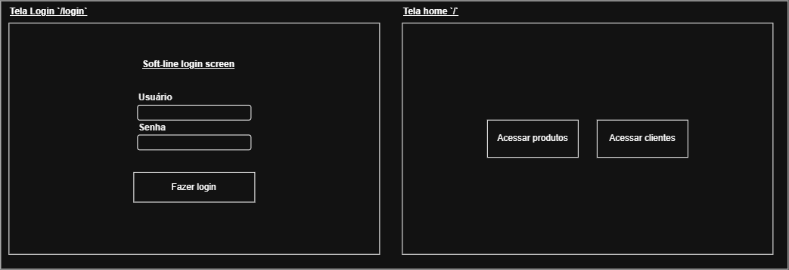
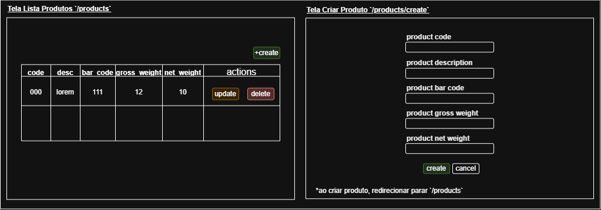
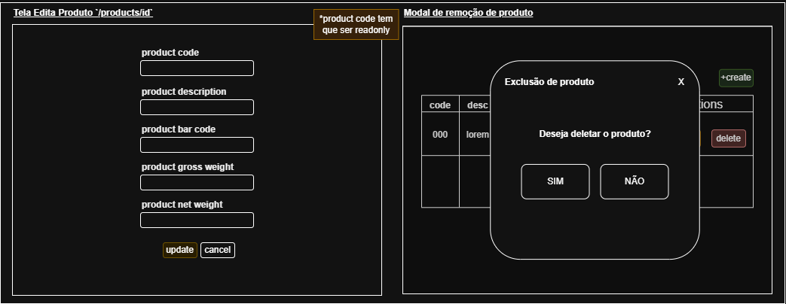
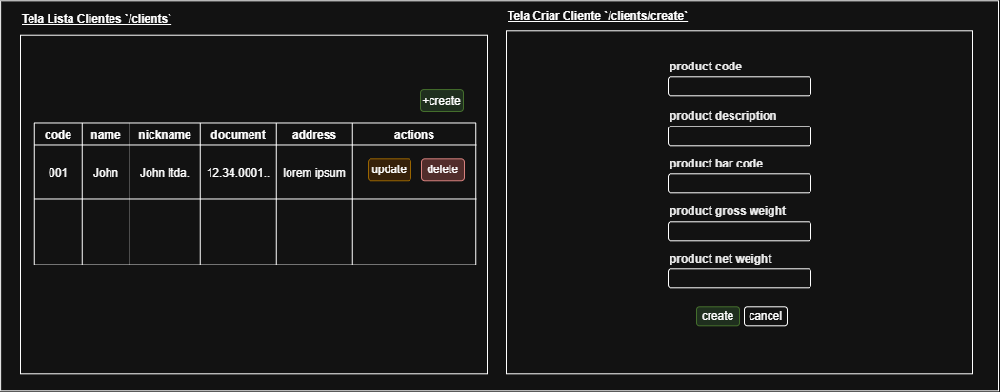
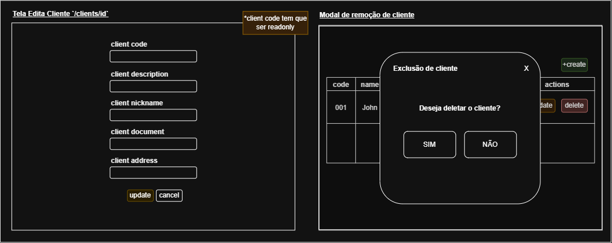

# Soft-Line Code Challenge

> Repositório do desafio técnico para Desenvolvedor Pleno da Soft-Line Sistemas.

## 🛢️ Database Tables Model


## 🛣️ Route Models


## 🔐 Login Screen Models


## 📦 Product Screen Models



## 👥 Customer Screen Models



## 🚀 How to Run This Project

### 📋 Requirements

Antes de rodar o projeto, certifique-se de instalar:

- ☕ **Java 17+**
- 🌱 **Spring Boot**
- 🗄️ **SQL Server**
- 📦 **Maven**

### ⚙️ Configuration

1. Clonando o repositório:

```bash
git clone http://github.com/gabriel-cheng/softline-challenge
cd softline-challenge
```
2. Rodando o projeto
```bash
mvn spring-boot:run
```

## 🔑 Endpoints

• To access ```products```, ex:
```
• Endpoint: http://localhost:8080/products

• Methods: [GET, POST, PATCH, DELETE]

• POST/PUT body request example:
{
    "code": 10,
    "description": "Lorem ipsum dolor sit amet.",
    "bar_code": 78949007000155,
    "gross_weight": 13.0,
    "net_weight": 12.05
}
```

• To access ```customers```, ex:
```
• Endpoint: http://localhost:8080/customers

• Methods: [GET, POST, PUT, DELETE]

• POST/PUT body request example:
{
    "code": 10,
    "name": "John Doe",
    "nickname": "John Doe's corp.",
    "document": "91711805000107",
    "address": "7404 Hayes Burgs, Apt. 836, 82527-9356, West Jersey, Utah, Estados Unidos"
}
```